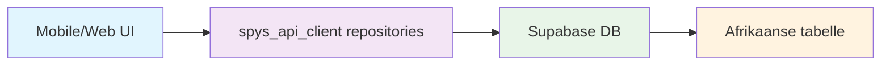
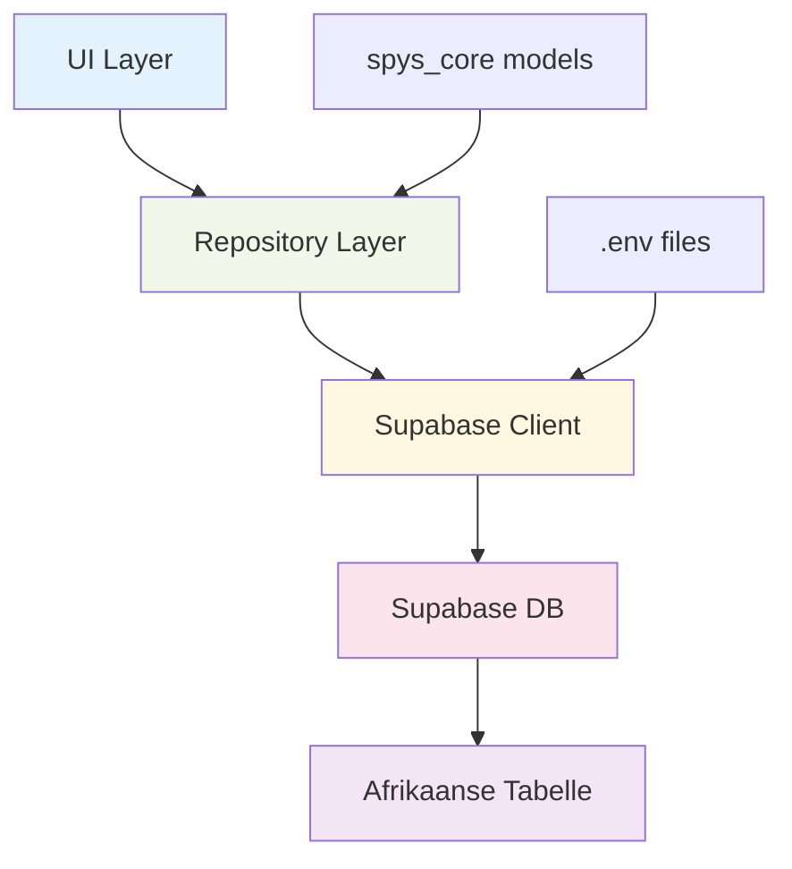
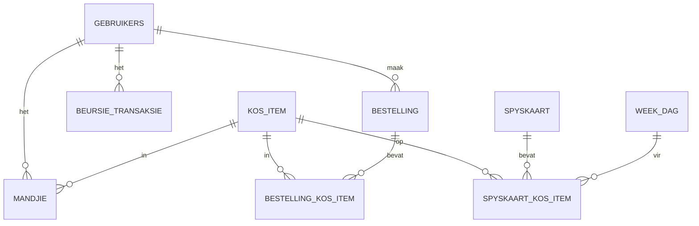

# Supabase & API Gids vir Spys Monorepo

## 📋 Inhoudsopgawe

1. [Oorsig](#1-oorsig)
2. [Projek-uitleg](#2-projek-uitleg)
3. [Omgewing (Sleutels & .env)](#3-omgewing-sleutels--env)
4. [Hoe die app connect na Supabase](#4-hoe-die-app-connect-na-supabase)
5. [Databasis-skema](#5-databasis-skema)
6. [RLS (Row Level Security)](#6-rls-row-level-security)
7. [Migrasies](#7-migrasies)
8. [Repositories & API-aanroepe](#8-repositories--api-aanroepe)
9. [Skryf jou eie API-call](#9-skryf-jou-eie-api-call)
10. [DB Test Page](#10-db-test-page)
11. [Algemene foute & vinnige oplossings](#11-algemene-foute--vinnige-oplossings)
12. [Hoe om te bou & run](#12-hoe-om-te-bou--run)
13. [Appendix](#13-appendix)

---

## 1. Oorsig

### Wat is Supabase?
Supabase is 'n "cloud databasis + auth + policies" - dit beteken:
- **Databasis**: Waar ons data stoor (gebruikers, kos items, bestellings)
- **Auth**: Wie mag toegang tot wat hê
- **Policies**: Reëls oor wie wat mag lees/skryf

### Hoe pas dit in ons Spys monorepo in?



**Hoëvlak data-vloei:**
1. UI (mobile/web) maak 'n aanroep
2. Repository in `spys_api_client` verwerk dit
3. Supabase DB stoor/gee data terug
4. UI wys resultaat aan gebruiker

---

## 2. Projek-uitleg

### Waar lê alles?

```
capstone/
├── apps/
│   ├── mobile/          # Flutter mobile app
│   └── admin_web/       # Flutter web admin
├── packages/
│   ├── spys_core/       # Datamodelle (json_serializable)
│   └── spys_api_client/ # Alle databeroepe (Supabase queries)
└── db/
    └── migrations/      # SQL om databasis te skep
```

### Data-vloei diagram



**Wat beteken dit?** Elke laag het 'n spesifieke taak - UI wys dinge, repositories praat met die databasis, en Supabase stoor alles.

---

## 3. Omgewing (Sleutels & .env)

### Waar is die .env lêers?

```
apps/mobile/.env.dev
apps/mobile/.env.prod
apps/admin_web/.env.dev
apps/admin_web/.env.prod
```

### Presiese sleutelnames

```bash
SUPABASE_URL=https://fdtjqpkrgstoobgkmvva.supabase.co
SUPABASE_ANON_KEY=eyJhbGciOiJIUzI1NiIsInR5cCI6IkpXVCJ9...
```

### Wenke:
- ✅ **Moenie commit nie** - `.env.*` lêers is in `.gitignore`
- ✅ **Hoe om te vervang**: Kopieer die waardes hierbo na jou .env lêers
- ✅ **Verifikasie**: `cat apps/mobile/.env.dev` moet 2 reëls wys

**Wat beteken dit?** Die .env lêers bevat die "adres" en "sleutel" om na ons Supabase databasis te gaan.

---

## 4. Hoe die app connect na Supabase

### Bootstrap proses

```dart
// apps/*/lib/bootstrap.dart
Future<void> bootstrapSupabase() async {
  await Supabase.initialize(
    url: dotenv.env['SUPABASE_URL']!,
    anonKey: dotenv.env['SUPABASE_ANON_KEY']!,
  );
}
```

### Wat gebeur wanneer die app oopmaak:

1. **dotenv.load()** - Laai die .env lêer
2. **Supabase.initialize()** - Maak verbinding met Supabase
3. **setupLocator()** - Registreer repositories
4. **runApp()** - Begin die app

**Wat beteken dit?** Die app "skakel aan" by Supabase voordat dit begin werk.

---

## 5. Databasis-skema

### Kern-tabelle in mensetaal:

| Tabel | Wat is dit? | Voorbeeld |
|-------|-------------|-----------|
| `gebruikers` | Wie is 'n gebruiker | Student, personeel |
| `kos_item` | 'n Ete/produk, prys, aktief | Boerewors rol (R45) |
| `spyskaart` | Dag/weke se spyskaart | Maandag se spyskaart |
| `spyskaart_kos_item` | Watter items op watter dag | Boerewors op Maandag |
| `mandjie` | Items wat jy wil bestel | Jou shopping cart |
| `bestelling` | Jou finale bestelling | Wat jy bestel het |
| `bestelling_kos_item` | Items in jou bestelling | 2x Boerewors, 1x Wrap |
| `beursie_transaksie` | Inbetalings/uitbetalings | R100 inbetaal |

### ER Diagram



**Wat beteken dit?** Hierdie diagram wys hoe tabelle aan mekaar gekoppel is - byvoorbeeld, 'n gebruiker kan baie bestellings hê.

---

## 6. RLS (Row Level Security)

### Wat is RLS?
RLS is soos 'n sekuriteitswag by 'n gebou - dit bepaal wie mag waar inkom.

### Ons beleide:

**Publieke lees vir katalogus:**
```sql
-- Enigeen mag kos items sien
create policy p_public_read_kos_item on public.kos_item 
for select using (true);
```

**"Sien net jou eie data":**
```sql
-- Jy mag net jou eie mandjie sien
create policy p_mandjie_self on public.mandjie
for all using (gebr_id = auth.uid());
```

### Hoe 'n gebruiker toegang kry:
- `auth.uid()` = Die huidige gebruiker se ID
- As jy nie aangemeld is nie = `null`

### Wat om te doen as jy 401/permission error sien:

```sql
-- Voeg 'n gebruiker ry toe
insert into public.gebruikers (gebr_id, gebr_epos, is_aktief)
values (auth.uid(), 'test@example.com', true)
on conflict (gebr_id) do update set is_aktief = excluded.is_aktief;
```

**Wat beteken dit?** RLS beskerm jou data - jy sien net wat jy moet sien.

---

## 7. Migrasies

### SQL Editor roete:

1. **Eers**: Run `db/migrations/0000_drop_public.sql`
2. **Dan**: Run `db/migrations/0001_init_spys.sql`

### Hoe om te verifieer:

```sql
-- Tel kos items
select count(*) from public.kos_item;

-- Kyk of tabelle bestaan
select table_name from information_schema.tables 
where table_schema = 'public';
```

### Seeds wat ingesit word:
- Kampus: Centurion
- Gebruiker tipes: Student, Personeel
- Kos items: Boerewors rol (R45), Veggie wrap (R55)

**Wat beteken dit?** Migrasies bou jou databasis van skrap af op.

---

## 8. Repositories & API-aanroepe

### Waar repositories leef:
```
packages/spys_api_client/lib/src/
├── gebruikers_repository.dart
├── spyskaart_repository.dart
├── mandjie_repository.dart
├── bestelling_repository.dart
└── beursie_repository.dart
```

### Hoekom repositories?
**UI mag nie direk na DB praat nie** → net via repositories

### Voorbeeld #1: GebruikersRepository

```dart
Future<Map<String, dynamic>?> kryGebruiker(String gebrId) async {
  final data = await _sb.from('gebruikers')
      .select()
      .eq('gebr_id', gebrId)
      .maybeSingle();
  return data;
}
```

**Wat doen dit?** Soek 'n gebruiker by hul ID en gee hul data terug.

### Voorbeeld #2: SpyskaartRepository

```dart
Future<List<Map<String, dynamic>>> lysAktiefOpDatum(DateTime datum) async {
  final dateStr = datum.toIso8601String().split('T')[0];
  final rows = await _sb.from('spyskaart')
      .select('''
        *,
        spyskaart_kos_item:spyskaart_kos_item(
          *,
          kos_item:kos_item_id(*)
        )
      ''')
      .gte('spyskaart_datum', dateStr)
      .lte('spyskaart_datum', dateStr);
  return List<Map<String, dynamic>>.from(rows);
}
```

**Wat doen dit?** Kry die spyskaart vir 'n spesifieke datum met alle kos items.

### Voorbeeld #3: MandjieRepository

```dart
Future<void> voegByMandjie({
  required String gebrId,
  required String kosItemId,
  int aantal = 1,
}) async {
  final data = {
    'gebr_id': gebrId,
    'kos_item_id': kosItemId,
  };
  await _sb.from('mandjie').insert(data);
}
```

**Wat doen dit?** Voeg 'n kos item by jou mandjie (shopping cart).

### Voorbeeld #4: BestellingRepository

```dart
Future<Map<String, dynamic>> skepBestelling({
  required String gebrId,
  required String kampusId,
  required List<BestellingItemInput> items,
}) async {
  // Skep bestelling
  final bestelling = await _sb.from('bestelling')
      .insert({
        'gebr_id': gebrId,
        'kampus_id': kampusId,
        'best_volledige_prys': 0.0,
      })
      .select()
      .single();
  
  // Voeg items by
  for (final item in items) {
    await _sb.from('bestelling_kos_item').insert({
      'best_id': bestelling['best_id'],
      'kos_item_id': item.kosItemId,
    });
  }
  
  return Map<String, dynamic>.from(bestelling);
}
```

**Wat doen dit?** Skep 'n nuwe bestelling en voeg alle items by.

### Voorbeeld #5: BeursieRepository

```dart
Future<List<Map<String, dynamic>>> lysTransaksies(String gebrId) async {
  final rows = await _sb.from('beursie_transaksie')
      .select('*')
      .eq('gebr_id', gebrId)
      .order('trans_geskep_datum', ascending: false);
  return List<Map<String, dynamic>>.from(rows);
}
```

**Wat doen dit?** Kry al jou beursie transaksies (inbetalings/uitbetalings).

---

## 9. Skryf jou eie API-call

### Doel: "Lys alle kositems bo 'n prys en net dié wat aktief is"

### Stap-vir-stap resep:

1. **Maak 'n metode in 'n repository** (kopieer 'n bestaande patroon)
2. **Skryf 'n query** met filters
3. **Toets dit** met 'n eenvoudige knoppie

### Volle voorbeeldfunksie:

```dart
// In packages/spys_api_client/lib/src/spyskaart_repository.dart

Future<List<Map<String, dynamic>>> lysKosItemsBoPrys(double prys) async {
  final rows = await _sb.from('kos_item')
      .select('*')
      .gt('kos_item_koste', prys)        // Bo die prys
      .eq('is_aktief', true)             // Net aktief
      .order('kos_item_koste', ascending: true);  // Sorteer by prys
  
  return List<Map<String, dynamic>>.from(rows);
}
```

**Verduideliking lyn vir lyn:**
- `from('kos_item')` - Kies die kos_item tabel
- `.select('*')` - Kry alle kolomme
- `.gt('kos_item_koste', prys)` - Net items bo die prys
- `.eq('is_aktief', true)` - Net aktief items
- `.order('kos_item_koste', ascending: true)` - Sorteer van goedkoop na duur

### Hoe om te gebruik in UI:

```dart
// In jou UI
final repository = sl<SpyskaartRepository>();
final duurItems = await repository.lysKosItemsBoPrys(50.0);
```

**Wat beteken dit?** Jy kan nuwe API calls skep deur bestaande patrone te kopieer en aan te pas.

---

## 10. DB Test Page

### Waar is dit:
```
apps/mobile/lib/pages/db_test_page.dart
apps/admin_web/lib/pages/db_test_page.dart
```

### Wat doen dit:
- Laai eerste 5 `kos_item` rye
- As aangemeld: laai huidige gebruiker se data
- Wys debug info en resultate

### Hoe om daar te kom:
- **Route**: `/db-test`
- **Mobile**: Knoppie op Home blad
- **Admin**: Knoppie op Dashboard

### Voorbeeld output:
```
Debug Info:
Connecting to: https://fdtjqpkrgstoobgkmvva.supabase.co
Count query: OK
Main query: OK
No user logged in

kos_item (eerste 5):
{kos_item_id: "670dcb2d-602e-4ffe-b5d5-074c7f7147cb", kos_item_naam: "Boerewors rol", kos_item_koste: 45.0, is_aktief: true}
{kos_item_id: "0271c4e7-76dc-4483-a731-39eb586be4ef", kos_item_naam: "Veggie wrap", kos_item_koste: 55.0, is_aktief: true}
```

**Wat beteken dit?** Die DB Test Page is jou "rooktoets" om te sien of alles werk.

---

## 11. Algemene foute & vinnige oplossings

### 401/403 → RLS/geen gebruiker-ry

**Symptome:**
```
PostgrestException (message: permission denied for schema public, code: 42501)
```

**Oplossing:**
```sql
-- Disable RLS vir toetsing
alter table public.kos_item disable row level security;

-- Of voeg gebruiker ry toe
insert into public.gebruikers (gebr_id, gebr_epos, is_aktief)
values (auth.uid(), 'test@example.com', true);
```

### Leë lys → seeds nog nie ingestel

**Symptome:** Geen data in tabelle nie

**Oplossing:**
```sql
-- Kyk of daar data is
select count(*) from public.kos_item;

-- As 0, run migrasies weer
-- Run 0000_drop_public.sql dan 0001_init_spys.sql
```

### Env nie gelaai → kyk dat .env.dev bestaan

**Symptome:** `SUPABASE_URL is null`

**Oplossing:**
```bash
# Kyk of .env lêer bestaan
ls apps/mobile/.env.dev

# As nie, skep dit
echo "SUPABASE_URL=https://fdtjqpkrgstoobgkmvva.supabase.co" > apps/mobile/.env.dev
echo "SUPABASE_ANON_KEY=eyJhbGciOiJIUzI1NiIsInR5cCI6IkpXVCJ9..." >> apps/mobile/.env.dev
```

### Analyze/test waarskuwings

**Symptome:** `melos run analyze` faal

**Oplossing:**
```bash
# Ignoreer warnings vir apps
melos run analyze:apps

# Of fix warnings een vir een
```

**Wat beteken dit?** Hierdie is die mees algemene probleme en hoe om hulle vinnig op te los.

---

## 12. Hoe om te bou & run

### Volledige setup:

```bash
# 1. Bootstrap alles
melos bootstrap

# 2. Bou codegen
melos run build

# 3. Run mobile app
melos run run:mobile

# 4. Run admin web app
melos run run:admin_web
```

### Hoe om in te teken:
1. Gaan na die app
2. Klik "Teken in" of "Sign in"
3. Gebruik jou e-pos en wagwoord
4. Jy is nou aangemeld

### Rooktoets:
1. Gaan na DB Test Page (`/db-test`)
2. Klik refresh knoppie
3. Jy moet data sien sonder foute

**Wat beteken dit?** Hierdie is die basiese stappe om die app te laat werk.

---

## 13. Appendix

### Gids vir RLS-policies

**Admin lees/skryf:**
```sql
-- Admin mag alles lees
create policy p_admin_read on public.kos_item 
for select using (auth.jwt() ->> 'role' = 'admin');

-- Admin mag alles skryf
create policy p_admin_write on public.kos_item 
for all using (auth.jwt() ->> 'role' = 'admin');
```

**Gebruiker net hul eie data:**
```sql
-- Gebruiker mag net hul eie bestellings sien
create policy p_user_orders on public.bestelling
for select using (gebr_id = auth.uid());
```

### SQL snippets wat nuttig is

**Voeg user ry met auth.uid():**
```sql
insert into public.gebruikers (gebr_id, gebr_epos, is_aktief)
values (auth.uid(), 'test@example.com', true)
on conflict (gebr_id) do update set is_aktief = excluded.is_aktief;
```

**Kyk RLS status:**
```sql
select schemaname, tablename, rowsecurity 
from pg_tables 
where schemaname = 'public';
```

**Tel rye in tabel:**
```sql
select count(*) from public.kos_item;
```

### Mini-woordeboek van hoof-tabelle

| Kolom | Betekenis | Voorbeeld |
|-------|-----------|-----------|
| `gebr_id` | Gebruiker se unieke ID | UUID |
| `gebr_epos` | Gebruiker se e-pos | "student@spys.co.za" |
| `is_aktief` | Is gebruiker aktief? | true/false |
| `kos_item_id` | Kos item se unieke ID | UUID |
| `kos_item_naam` | Naam van kos item | "Boerewors rol" |
| `kos_item_koste` | Prys van item | 45.00 |
| `best_id` | Bestelling se unieke ID | UUID |
| `best_geskep_datum` | Wanneer bestelling gemaak is | timestamp |
| `trans_bedrag` | Bedrag van transaksie | 100.00 |

**Wat beteken dit?** Hierdie appendix bevat nuttige inligting vir wanneer jy dinge wil aanpas of debug.

---

## 🎉 Klaar!

Jy het nou 'n volledige begrip van hoe Supabase in die Spys monorepo werk. Jy kan:
- ✅ Nuwe API calls skep
- ✅ Database queries skryf
- ✅ Foute debug en oplos
- ✅ Die app bou en run

**Volgende stappe:** Begin met eenvoudige queries en bou geleidelik op na meer komplekse funksionaliteit. 